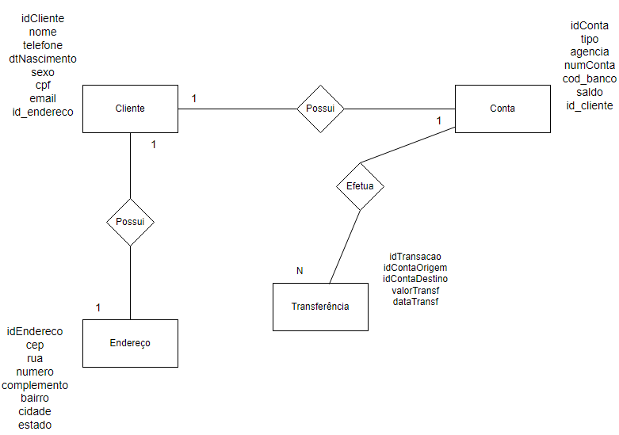
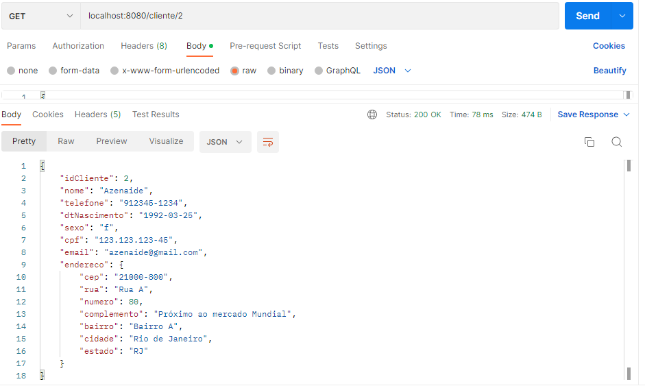
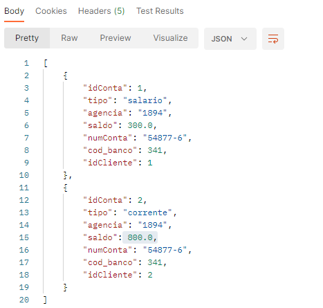
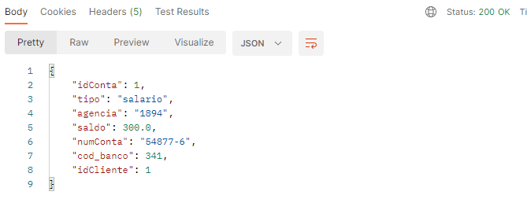

# 

Projeto final do bootcamp **#ElasTech**, promovido pela PagSeguro/PagBank.

</br>


## 💻 1. Proposta do Projeto
Criar um sistema para um banco fictício que seja capaz de gerenciar clientes e as transações realizadas.  </br>
O sistema deve permitir cadastro de novos clientes, incluindo dados pessoais e dados para contato.  
O cliente deve estar atrelado a uma conta bancária com um valor inicial de saldo. Deve ser possível fazer transferência de um cliente para outro e esse histórico de transações entre as contas deve ser registrado.</br> </br>

## 💻 2. Regras de Negócio
Regras de negócio definidas pelos membros do grupo.  
</br>
- **Cliente** - O cliente terá as seguintes funcionalidades:
    - Cadastro;
    - Edição;
        - Somente o nome, telefone, email e endereço poderão ser alterados.
    - Listar os Clientes;
        - Buscar todas os cliente;
        - Buscar cliente por Id.
    - Deletar Cliente.    
      <br>

- **Conta** - A conta deverá ter as seguintes funcionalidades:
    - Cadastro;
    - Edição;
        - Somente os campos referentes ao número da conta e agência poderão ser editados.
    - Lista das Contas;
        - Buscar todas as contas;
        - Buscar conta por Id.

<br>

- **Transferência** - A transferência deverá ter as seguintes funcionalidades:
    - Realizar transferência;
        - Caso o saldo do cliente seja menor do que o valor a transferir, a transferência não será realizada.
    - Listar as transferências realizadas.

<br>

## 📋 3. Modelagem ER
</br>



</br>

## 📌 4. Tarefas:

- [x] Criar contas no Git
- [x] Criar projeto no Spring Initializr
- [x] Construir o modelo de objetos
- [x] Codificar as classes de modelo
- [x] Subir a estrutura inicial do projeto no GitHub
- [x] Criar a camada de Controller para Cliente
- [x] Criar a camada de Controller para Conta
- [x] Criar a camada de Controller para Tranferência
- [x] Implementar os métodos do Controller de Cliente
- [x] Implementar os métodos do Controller de Conta
- [x] Implementar os métodos do Controller de Transferência
- [x] Colocar as annotations adequadas nas classes Controller
- [x] Criar a camada de Serviço para Cliente
- [x] Criar a camada de Serviço para Conta
- [x] Criar a camada de Serviço para Transferência
- [x] Criar a interface Repository para Cliente
- [x] Criar a interface Repository para Conta
- [x] Criar a interface Repository para Tranferência
- [x] Incluir o Spring Data JPA no projeto
- [x] Definir a ferramenta de Teste (**Postman**, Insomnia, Curl)
- [x] Editar o método de editar Conta
- [x] Executar o sistema com o banco de dados H2
- [x] Executar o sistema com o banco de dados MySQL
- [x] Fazer o método para editar alguns dados do Cliente
- [x] Construir o README
- [x] Executar os últimos testes


<br/>

## ⚙ 5. Como executar o projeto:

### 5.1 Clonando o projeto

Primeiro, clone o repositório para o seu ambiente:

```bash
> git clone https://github.com/carmenMarchesi/dElasBank.git
```  

</br>

### 5.2 Executando no IntelliJ

Ao abrir o projeto no IntelliJ, ir em **src** > **main** > **resources** > **"application.properties"** e colocar a sua senha de acesso ao seu MySQL.

<br>


<br>

Ir em **src** > **main** > **java** > **delasbank** > **"Delasbank.application"** e executar o projeto.
<br>
Após o IntelliJ confirmar que a aplicação foi iniciada, realizar as inserções e os testes no **Postman**.


<br>

### 🔎 5.3 Testando a aplicação no Postman


#### **Criar Cliente:**

POST - localhost:8080/cliente/novo


``` 
{
        "nome": "Nome Cliente",
        "telefone": "912345-1234",
        "dtNascimento": "1992-03-25",
        "sexo": "f",
        "cpf": "123.123.123-45",
        "email": "cliente@gmail.com",
        "endereco": {
            "cep": "21000-800",
            "rua": "Rua A",
            "numero": 80,
            "complemento": "Próximo ao mercado Mundial",
            "bairro": "Bairro A",
            "cidade": "Rio de Janeiro",
            "estado": "RJ"
        }
    }
``` 

</br>

#### **Listar Clientes:**

GET - localhost:8080/cliente/todos


</br>

#### **Listar Cliente por Id:**
GET - localhost:8080/cliente/id_cliente



</br>

#### **Editar Cliente:**

PUT - localhost:8080/cliente/alterar/id_cliente

Colocar os dados que deseja alterar, **lembrando que cliente só poderá alterar o nome, telefone, email e os dados de endereço**.

``` 
{
    "idCliente": 2,
    "nome": "Carmen Marchesi",
    "cpf": "123.000.123-45",
    "email": "carmen@gmail.com",
    "endereco": {
      "cep": "21000-800",
      "rua": "Rua A",
      "numero": 80,
      "complemento": "Próximo ao mercado Mundial",
      "bairro": "Bairro A",
      "cidade": "Rio de Janeiro",
      "estado": "RJ"
    }
}
```   

</br>

#### **Deletar Cliente:**

DELETE - localhost:8080/cliente/deletar/id-a-deletar


<br>

#### **Criar Conta:**

POST - localhost:8080/conta/cadastrar


``` 
{
    "tipo": "corrente",
    "agencia": "1894",
    "numConta": "54877-6",
    "saldo": 600.0,
    "cod_banco": 341,
    "idCliente": 1
}
```

</br>

#### **Listar Contas:**

GET - localhost:8080/conta/todos



<br>

#### **Listar Contas por Id:**
GET - localhost:8080/conta/dados/id_conta



</br>

#### **Editar Conta:**

PUT - localhost:8080/conta/alterar/id_conta

Colocar os dados que deseja alterar, **lembrando que na conta só poderá ser alterado o número da conta e a agência**.

``` 
{
  "idConta": 1,
  "agencia": "1774",
   "numConta": "54877-6"
}
```   

#### **Deletar Conta:**
DELETE - localhost:8080/cliente/deletar/id-a-deletar


</br>

#### **Realizar Transferência:**

POST - localhost:8080/transferencia/transferir

``` 
{ 
    "valor": 500.0,  
    "dataTransf":"2022-11-27",    
    "idContaOrg":1,
    "idContaDest":2
}
```   
<br>

**OBSERVAÇÃO:**  
Caso o saldo do cliente seja menor do que o valor a ser transferido, será apresentado um aviso informando que a transferência não foi realizada.


<br>

#### **Listar Transferências:**

GET - localhost:8080/transferencia/listar


<br>

#### **Listar Transferência por Id:**

GET - localhost:8080/transferencia/listar/id_transacao


<br>

### 💾 5.4 Consultas no Banco
**Mostrar informações do cliente e a sua conta:**
```sql
> SELECT  c.id_cliente, c.nome as Nome, c.cpf as CPF, c.dt_nascimento as "Data de Nascimento", c.sexo as Sexo, c.email as "E-mail",   
c.telefone as Contato, c.rua as Rua, c.numero as "nº", c.complemento as Complemento, c.bairro as Bairro, c.cidade as Cidade, c.estado as Estado,  
c.cep as CEP, ct.agencia as "Agência", ct.num_conta as Conta, ct.tipo as TipoConta, ct.cod_banco as Banco, ct.saldo as SaldoConta  
FROM cliente c  
INNER JOIN conta ct ON (c.id_cliente = ct.cliente_id_cliente);
``` 
</br>


**Mostrar as transferências realizadas:**
```sql
> select id_transacao, data_transf as diaTransferencia, conta_origem_id_conta as contaOrigem, conta_destino_id_conta as 
contaDestino, valor  from transferencia;
``` 
</br>

## 📋 6. Melhorias

Pontos observados que poderiam ter sido feitos de forma diferente ou funcionalidades que gostaríamos de ter adicinado:

- Funcionalidade de saque;
- Funcionalidade de depósito;
- Criar métodos para inativar o cliente, não excluir.
- Ter tido tempo de integrar a aplicação com o frontend.
- Excluir o histórico de transações ao excluir uma conta.

<br>

## 🤝 7. Integrantes do Grupo

[Carmen Marchesi](https://www.linkedin.com/in/carmen-marchesi/)  
[Azenaide Fernandes](https://www.linkedin.com/in/azenaide-fernandes-8a28554b/)  
[Nicolle Gianinni](https://www.linkedin.com/in/nicollegianinni/)  
[Estefania Carrer](https://www.linkedin.com/in/estefania-rilko-carrer-49659110a/)  
[Marly Valentim ](https://www.linkedin.com/in/marly-valentim-23554731/)  
